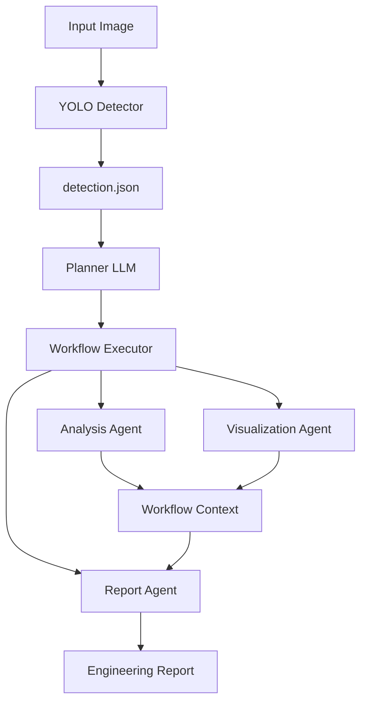
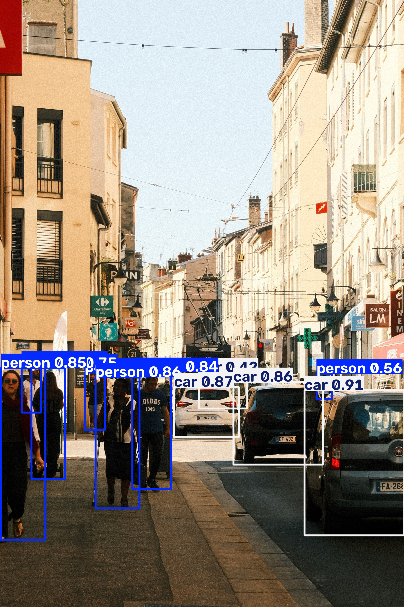
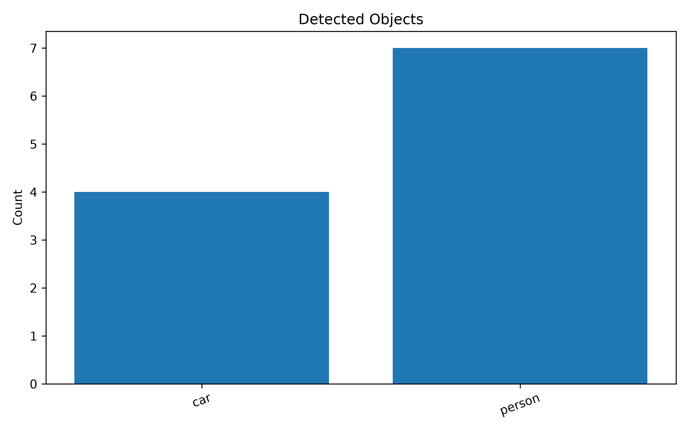
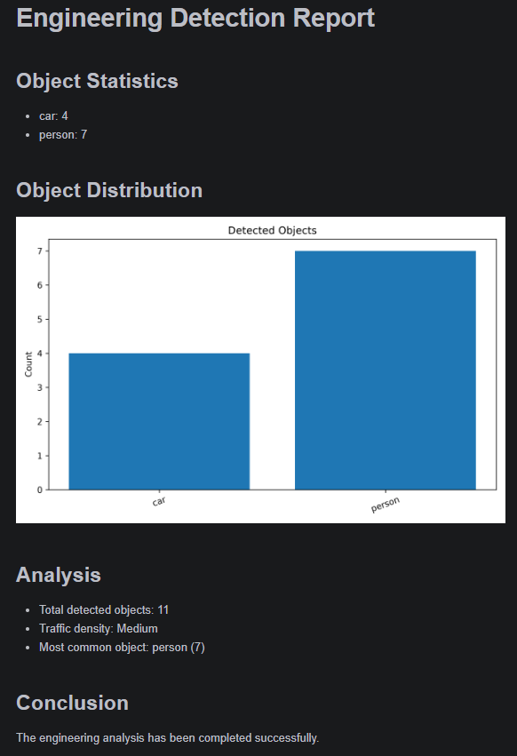

# Vision Agent: Multi-Agent Traffic Scene Analysis

A lightweight multi-agent vision system for traffic scene analysis based on **YOLOv8** and **Google Gemini**.

The project integrates object detection, workflow planning, statistical analysis, visualization, and automatic report generation into a complete engineering pipeline.

---

## Features

- YOLOv8 object detection
- Multi-Agent architecture
- Gemini-based workflow planning
- Automatic object statistics
- Automatic visualization generation
- Automatic engineering report generation
- Modular workflow execution

---

## System Architecture



---

## Demo

### Input Image


---

### Object Detection

YOLOv8 detects all objects in the scene and generates a detection result with bounding boxes.



---

### Object Distribution

The visualization agent automatically generates a statistical bar chart.



---

### Engineering Report

The report agent automatically generates an engineering report containing object statistics, visualization, scene analysis and conclusions.



---

## Workflow

The system executes the following pipeline.

```text
Input Image
      │
      ▼
YOLO Detector
      │
      ▼
detection.json
      │
      ▼
Planner (Gemini)
      │
      ▼
Workflow Executor
      │
      ├────────► Analysis Agent
      │
      ├────────► Visualization Agent
      │
      └────────► Report Agent
                  │
                  ▼
         Engineering Report
```

---

## Project Structure

```text
vision-agent
│
├── agents
│   ├── analysis.py
│   ├── planner.py
│   └── report.py
│
├── core
│   └── vision_agent.py
│
├── workflow
│   ├── executor.py
│   └── registry.py
│
├── tools
│   ├── yolo_detector.py
│   ├── visualization.py
│   └── file_reader.py
│
├── data
│   └── detection.json
│
├── images
│   └── traffic.jpg
│
├── reports
│   ├── detection_result.jpg
│   ├── object_distribution.png
│   ├── report.md
│   └── report_preview.png
│
├── main.py
├── requirements.txt
└── README.md
```

---

## Output

After execution, the following files are automatically generated.

```text
data/
└── detection.json

reports/
├── detection_result.jpg
├── object_distribution.png
└── report.md
```

The report contains:

- Object statistics
- Object distribution chart
- Traffic density analysis
- Most common object
- Engineering conclusion

---

## Installation

Clone the repository.

```bash
git clone https://github.com/Spike1031/vision-agent.git
cd vision-agent
```

Install dependencies.

```bash
pip install -r requirements.txt
```

---

## Configuration

Create a `.env` file in the project root.

```text
GEMINI_API_KEY=YOUR_API_KEY
```

Download the YOLOv8 model.

```text
yolov8n.pt
```

Place it in the project root directory.

---

## Usage

Run the project.

```bash
python main.py
```

---

## Technologies

- Python
- YOLOv8
- Google Gemini API
- Matplotlib
- JSON
- Multi-Agent System

---

## License

MIT License